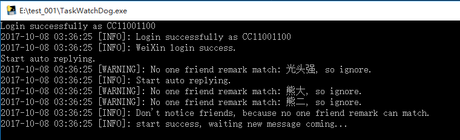
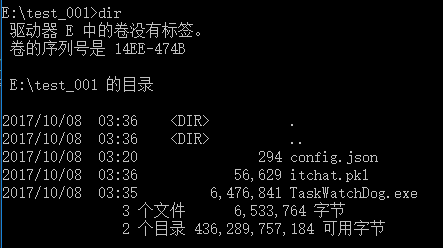
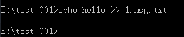

## TaskWatchDog

### 1. TaskWatchDog是什么
具体怎么来形容呢，它的出现是为了解决这样一类需求的：当你跑了一个很耗时的任务但是拿不准何时结束的时候，难道要傻傻的等在计算机前等它结束吗？所以我就在想能不能让它跑完了自己通知我一下呢，这样我就可以分身去做更有趣的事情啦，它跑完了会自己“回调”我的 :)  
所以呢，这个小东西就是可以方便的将任务进度用微信通知到你。


### 2. 如何使用
#### 快速开始：Windows
单击此链接下载打包好的可执行文件：  
[TaskWatchDog.exe for Windows 10](http://www.foo.com)  
下载配置文件：  
[config.json](https://github.com/CC11001100/TaskWatchDog/blob/master/config.json)  
将下载的可执行文件和配置文件放到同一个目录，双击可执行文件启动程序，程序启动时需要登录微信，会使用图片查看器打开一张二维码，扫描登录，启动成功后大概是这个样子：

测试程序是否能正常工作：  
打开CMD，切换到存放上面程序的目录：
  
在此目录下创建一个文件，并写点东西进去，记得文件的后缀得是以“msg.txt”结尾的：  
  
打开刚才扫码登录的微信，“文件传输助手”已经收到了消息：
  

如果程序运行出现问题，请阅读 自定义编译打包部分或给我发邮件[CC11001100@qq.com](mailto:CC11001100@qq.com)。

#### 快速开始：Linux


#### 多个微信号


#### 2.1 下载安装
因为是使用python3开发的，所以是跨平台的，但是因为使用到了一些第三方的库（感谢itchat），所以如果只下载源码的话还需要安装对应的依赖库，所以这里提供了三种方式使用：
#### 2.1.1 下载打包好的Windows可执行文件
#### 2.1.2 下载打包好的Linux可执行文件
#### 2.1.3 下载源码自己编译

#### 配置详解
程序运行需要配置文件，使用--config选项指定配置文件的位置：  
`TaskWatchDog --config ./config.json`  
如果不指定的话默认会在当前目录下读取名为“./config.json”的配置文件。

配置文件使用json格式，结构大致如下：
```
{
	"watch_path": "./",
	"notice_filehelper": true,
	"notice_friends": [
		{
			"remark_name": "光头强"
		},
		{
			"remark_name": "熊大"
		},
		{
			"remark_name": "熊二"
		}
	],
	"remove_old_msg": false,
	"message_content_max_length": 1024,
	"use_shell_qrcode": false
}
```
NOTE： 上述内容必须全部指定，程序启动的时候会对配置文件合法性进行一个简单的检查，配置错误将导致程序无法启动。
watch_path: <string>，要监控的目录，当在这个目录下发生创建文件事件时，将触发发送事件。
notice_filehelper: <boolean>，是否要通知到文件助手，这个在只有一个微信号的时候比较有用。
notice_friends: <array>，要通知到的好友，是一个数组，数组中的对象使用remark_name来标识好友，当好友的备注匹配此字符串时将会发送给TA，每条消息都会通知到数组中的每一个人。
remove_old_msg: <boolean>，是否要删除已经读取过的消息，可以节省一些磁盘空间吧。
message_content_max_length: <number>，微信发送的消息有最大长度限制，好吧其实我也不太常用微信不太熟，so，就交给使用者来掌控吧 ：)
use_shell_qrcode: <boolean>，微信登录是要扫码的，这在Windows下当然木有问题，但是在Linux下没有GUI时就比较悲剧了，所以在没有GUI的情况下应该将此项设置为true，扫描字符二维码登录。


### 新版计划
1. 加入多种消息格式支持（图片、文件、语音等等）
2. 更多还没想好，反正估计又是挖坑不填....


.
