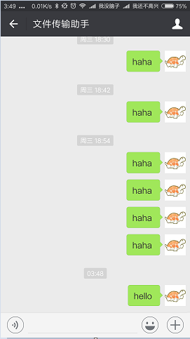

## TaskWatchDog

## 1. TaskWatchDog是什么
具体怎么来形容呢，它的出现是为了解决这样一类需求的：当你跑了一个很耗时的任务但是拿不准何时结束的时候，难道要傻傻的等在计算机前等它结束吗？所以我就在想能不能让它跑完了自己通知我一下呢，这样我就可以分身去做更有趣的事情啦，它跑完了会自己“回调”我的 :)  
所以呢，这个小东西就是可以方便的将任务进度用微信通知到你。  

原理就是会监控某个目录下的文件创建事件，把你需要发送的消息以文件的形式创建在此目录下，即可触发事件发送到微信。  

## 2. 如何使用
### 快速开始：Windows
单击此链接下载打包好的可执行文件：  
[TaskWatchDog.exe for Windows 10](https://raw.githubusercontent.com/CC11001100/TaskWatchDog/master/dist/Windows/Windows%2010/TaskWatchDog.exe)  
下载配置文件：  
[config.json](https://raw.githubusercontent.com/CC11001100/TaskWatchDog/master/config.json)  
将下载的可执行文件和配置文件放到同一个目录，双击可执行文件启动程序，程序启动时需要登录微信，会使用图片查看器打开一张二维码，扫描登录，启动成功后大概是这个样子：  
  
测试程序是否能正常工作：  
打开CMD，切换到存放上面程序的目录：  
  
在此目录下创建一个文件，并写点东西进去，记得文件的后缀得是以“msg.txt”结尾的：  
  
打开刚才扫码登录的微信，“文件传输助手”已经收到了消息：  
  

如果程序运行出现问题，请阅读[源码安装](#源码安装)部分或给我发邮件[CC11001100@qq.com](mailto:CC11001100@qq.com)或提Issue。

### 快速开始：Linux
单击此链接下载打包好的可执行文件：  
[TaskWatchDog for CentOS](https://raw.githubusercontent.com/CC11001100/TaskWatchDog/master/dist/Linux/CentOS/TaskWatchDog)  
下载配置文件：  
[config.json](https://raw.githubusercontent.com/CC11001100/TaskWatchDog/master/config.json)  
将config.json的use_shell_qrcode修改为2，如果感觉过宽的话就修改为true，修改后的config.json文件如下：  
```
{
	"watch_path": "./",
	"notice_filehelper": true,
	"notice_friends": [],
	"remove_old_msg": false,
	"message_content_max_length": 1024,
	"use_shell_qrcode": 2
}
```
将下载的可执行文件和配置文件放到同一个目录，启动程序并扫码登录：  
  
测试程序是否能正常工作：  
`echo linux:haha >> 1.msg.txt`  
打开扫码登录的微信，查收消息：  
  

如果程序运行出现问题，请阅读[源码安装](#源码安装)部分或给我发邮件[CC11001100@qq.com](mailto:CC11001100@qq.com)或提Issue。

### 源码安装
本软件使用python3编写，请先安装python3版本。  
Redhat、CentOS系Linux可直接使用以下命令安装py3：  
```
sudo yum install epel-release
sudo yum install python34
```
如果打包好的没有适合自己系统的或者是无法运行的，需要下载源码安装：  
```
wget https://raw.githubusercontent.com/CC11001100/TaskWatchDog/master/config.json    
wget https://raw.githubusercontent.com/CC11001100/TaskWatchDog/master/TaskWatchDog.py  
```
编译前需要安装相应的依赖：  
[itchat](https://pypi.python.org/pypi/itchat/1.1.13)  
[watchdog](https://pypi.python.org/pypi/watchdog/0.8.3)  
使用pip安装：  
```
python3 -m pip install itchat  
python3 -m pip install watchdog  
```
如果没有安装pip，如何安装pip请参考[Installation — pip 9.0.1 documentation](https://pip.pypa.io/en/stable/installing/)  
修改config.json，将use_shell_qrcode设置为true，如果发现字符二维码过窄就设置为2，启动程序：   
`python3 TaskWatchDog.py`  
扫码登录：  
  
测试功能是否可用：   
`echo linux:haha >> 1.msg.txt`  
打开扫码登录的微信，查收消息：  
  

如果需要打包的话安装pyinstaller:  
`python3 -m pip install pyinstaller`  
然后打包成单文件：  
`pyinstaller -F TaskWatchDog.py`  
dist目录下的就是打包好的Linux下的可执行文件啦：  
    

如有问题，发邮件联系我[CC11001100@qq.com](mailto:CC11001100@qq.com)或提Issue。


### 多个微信号
当有多个微信号的时候，拿一个小号做机器人，比如将机器人号和常用号互加好友，在机器人号设置常用号备注，notice_friends设置备注名字，扫码登录机器人号，可以一直挂着，通知到常用号，这样子才是比较酷的，不过微信号限制注册了，我也没那么多马甲，这个暂时不出演示文档了。


## 3. 配置详解
程序运行需要配置文件，使用--config选项指定配置文件的位置：  
`TaskWatchDog --config ./config.json`  
如果不指定的话默认会在当前目录下读取名为“./config.json”的配置文件。

配置文件使用json格式，结构大致如下：
```
{
	"watch_path": "./",
	"notice_filehelper": true,
	"notice_friends": [
		{
			"remark_name": "光头强"
		},
		{
			"remark_name": "熊大"
		},
		{
			"remark_name": "熊二"
		}
	],
	"remove_old_msg": false,
	"message_content_max_length": 1024,
	"use_shell_qrcode": false
}
```
NOTE： 上述内容必须全部指定，程序启动的时候会对配置文件合法性进行一个简单的检查，配置错误将导致程序无法启动。  
**watch_path: &lt;string&gt;** 要监控的目录，当在这个目录下发生创建文件事件时，将触发发送事件。  
**notice_filehelper: &lt;boolean&gt;** 是否要通知到文件助手，这个在只有一个微信号的时候设置为true，通知给自己。  
**notice_friends: &lt;array&gt;** 要通知到的好友，是一个数组，数组中的对象使用remark_name来标识好友，当好友的备注匹配此字符串时将会发送给TA，每条消息都会通知到数组中的每一个人。  
**remove_old_msg: &lt;boolean&gt;** 是否要删除已经读取过的消息。  
**message_content_max_length: &lt;number&gt;** 微信发送的消息有最大长度限制，好吧其实我也不太常用微信不太熟，so，就交给使用者来掌控吧 ：)  
**use_shell_qrcode: &lt;boolean&gt;** 微信登录是要扫码的，这在Windows下当然木有问题，但是在Linux下没有GUI时就比较悲剧了，所以在没有GUI的情况下应该将此项设置为true，扫描字符二维码登录。如果将此项设置为true的话，可能会出现字符二维码过窄的情况，这时候将其设置为2即可，如果仍窄依次类推。  


## 4. 示例代码
因为是使用文件系统黏在一起的，所以消息生产者可以是py、java、bash、ruby、php、c++、powershell....只要能够写文件就可以。  
示例暂略，无非就是写个工具类将文本写入到指定目录下，文件名用时间戳或者UUID啥的保证每次不同即可，很一贼的。  
有个坑：代码写文件的时候（管道流同理），文件已经存在的情况下，w模式是先清空文件，再往文件中写内容，所以会触发两次修改事件并不是想象的一个创建事件、一个修改事件，而a模式只会触发一个修改事件，所以如果固定写入一个名字相同的文件的话，将remove_old_msg置为true。  
还有个坑，原理就是调用的网页版微信，发送过频繁的话会被封掉，过几天就好了，验证自己微信状态去扫码登陆下网页版微信就可以了。  


## 5. 新版计划
- 加入多种消息格式支持（图片、文件、语音等等）  
- 更多还没想好，反正估计又是挖坑不填....  
